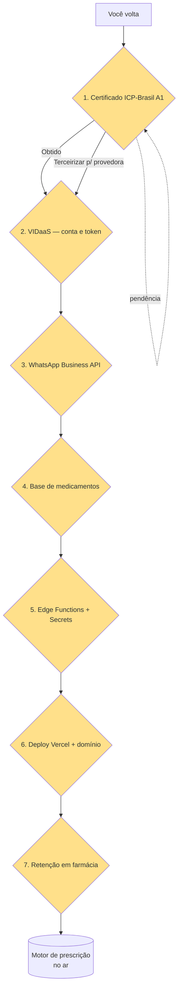

# Fluxograma de Pendências — Motor de Prescrição Digital (prescreve.com)

> O que **já foi preparado tecnicamente** (sem depender de você) está no fim deste
> documento. Aqui estão as **pendências que exigem ação manual** (contas, certidões,
> chaves, contratos) e a ordem recomendada.

---

## Visão geral (fluxo)

---

## Pendência 1 — Certificado ICP-Brasil (Certificado A1 · PFX)

**O que é:** a assinatura digital de receitas exige um certificado digital padrão ICP-Brasil (obrigatório no Brasil para assinatura eletrônica com validade jurídica — MP 2.200-2/2001).

**Passos:**
1. Escolha uma Autoridade Certificadora (AC) credenciada: **Certisign**, **Soluti**, **Serpro**, **Caixa**, **Banco do Brasil** etc.
2. Contrate o **Certificado A1** (arquivo `.pfx`/`.p12`) — o A1 fica no computador/servidor (diferente do A3, que é em token/cartão).
3. Receba o arquivo `.pfx` + **senha** da AC.
4. Guarde o arquivo e a senha com segurança. Na plataforma, eles entram como **secrets** (nunca no repositório):
   - `ICP_PFX_BASE64` (o `.pfx` codificado em base64)
   - `ICP_PFX_SENHA`
5. **Atenção legal:** para **receitas de controle especial (azul/amarela)** é obrigatório manter a **retenção da receita** na farmácia e o envio ao **SNGPC (Anvisa)** — ver Pendência 7.

> ⏱ Estimativa: 1–5 dias úteis (análise da AC + emissão).

---

## Pendência 2 — VIDaaS (validação de identidade digital)

**O que é:** VIDaaS é a API do governo (Secretaria Especial de Desburocratização) para **validação de identidade digital** — usada para confirmar o titular do certificado e o "validador de assinatura integrado" da plataforma.

**Passos:**
1. Contrate/credencie-se na **VIDaaS** (via gov.br / operadora credenciada).
2. Obtenha o **access token** / credenciais da API.
3. Configure como secret da Edge Function:
   - `VIDaaS_ACCESS_TOKEN`
4. Integração técnica (futura): a Edge Function `assinar-receita` consulta a VIDaaS para validar a identidade antes de efetivar a assinatura, e o validador confere o hash/documento.

> ⏱ Estimativa: 2–10 dias úteis (credenciamento + contrato).

---

## Pendência 3 — WhatsApp Business API (notificações)

**O que é:** envia notificações de receita/prescrição ao paciente (ex.: "sua receita foi assinada").

**Passos:**
1. Crie/valide um número na **Meta Business Platform** (business.facebook.com).
2. Configure o **WhatsApp Business API** (via Meta Cloud API ou provedor BSP como Z-API, Twilio, Gupshup).
3. Obtenha:
   - `WHATSAPP_ACCESS_TOKEN`
   - `WHATSAPP_PHONE_NUMBER_ID`
   - `WHATSAPP_WEBHOOK_VERIFY_TOKEN`
4. Configure o **webhook** apontando para a Edge Function (ex.: `/functions/v1/whatsapp-webhook`) e o verify token acima.
5. Crie os **modelos (templates)** aprovados pela Meta (ex.: `receita_assinada`, `receita_retida`).

> ⏱ Estimativa: 1–7 dias (aprovação de templates pela Meta).

---

## Pendência 4 — Base de medicamentos

**O que é:** o banco de medicamentos para autocompletar a prescrição.

**Opções:**
1. **Importar dados públicos da Anvisa** (lista de medicamentos/DCB) para a tabela `medicamentos` já criada — via script de importação.
2. **Preencher manualmente** o padrão da sua unidade/UPA (opção rápida para começar).
3. Integrar com provedores de base (ex.: bases comerciais).

> Deixei a tabela `medicamentos` + RLS prontas (leitura para todos os autenticados; escrita super admin).

---

## Pendência 5 — Edge Functions + Secrets (integrações)

**O que é:** funções serverless do Supabase que usam as chaves acima sem expô-las.

**Criar (quando voltar):**
- `assinar-receita` — assina a prescrição com o certificado A1 (via lib como `node-signpdf`/`@signpdf` ou provedora ICP) + VIDaaS.
- `validar-assinatura` — validador integrado (confere hash + certificado).
- `resolve-receita` — resolve os deep links `/r/emissao/:token` e `/r/consulta/:token`.
- `whatsapp-webhook` + `notificar-whatsapp` — envio e recebimento de notificações.
- `gerar-receita-pdf` — gera o PDF assinado e grava no bucket `receitas`.

**No Dashboard do Supabase → Edge Functions → Secrets**, adicionar: `ICP_PFX_BASE64`, `ICP_PFX_SENHA`, `VIDaaS_ACCESS_TOKEN`, `WHATSAPP_ACCESS_TOKEN`, `WHATSAPP_PHONE_NUMBER_ID`, `WHATSAPP_WEBHOOK_VERIFY_TOKEN`, `SMTP_*`.

---

## Pendência 6 — Deploy (Vercel + domínio)

**Passos:**
1. Conecte o repositório ao **Vercel**.
2. Defina as variáveis `VITE_SUPABASE_URL` e `VITE_SUPABASE_ANON_KEY` no Vercel (as mesmas do `.env.local`).
3. Após o deploy, configure **domínio próprio** (ex.: `receita.suaupa.com.br`) — necessário para deep links estáveis.
4. Ajuste o `site_url` / redirects do Auth do Supabase para o novo domínio.

---

## Pendência 7 — Retenção de receitas em farmácias

**O que é:** para **medicamentos controlados (receituário azul/amarelo, portaria 344/98)** a farmácia deve reter a 1ª via; o envio ao **SNGPC** é obrigatório.

**Passos:**
1. Decidir o fluxo: a farmácia acessa a receita por **deep link de consulta** (`/r/consulta/:token`), imprime/valida e registra a retenção.
2. Na plataforma, a tabela `receitas_retidas` já existe (append-only) — a Edge Function registra a retenção com código.
3. **Integração SNGPC:** contrato/credencial com o sistema da Anvisa (pendência externa) para envio automático dos receituários controlados.

---

## Já preparado (sem precisar de você)

- ✅ Schema Fase 2: `medicamentos`, `pacientes`, `cuidados_plantonistas`, `prescricoes`, `prescricao_itens`, `assinaturas`, `receitas_retidas`, `notificacoes_whatsapp`, `configuracoes_unidade`, `links_publicos_receita`
- ✅ RLS em todas (auditado: 0 tabelas sem RLS). Regra inviolável mantida: **admin só vê agregados** (`vw_indicadores_unidade`); **plantonista só vê pacientes sob seu cuidado**; gestor vê a unidade
- ✅ Bucket privado `receitas` (PDFs assinados)
- ✅ Rota pública de deep link `/r/:tipo/:token` (emissão e consulta)
- ✅ Placeholders de secrets no `.env.example`
- ✅ View agregada `vw_indicadores_unidade` (com supressão < 5)

## Próximo código (quando voltar, em ordem)

1. Edge Functions (Pendência 5) — `gerar-receita-pdf`, `assinar-receita`, `validar-assinatura`, `resolve-receita`, `whatsapp-webhook`
2. UI do plantonista: criar prescrição (paciente → itens → assinar)
3. Portal do paciente / farmácia via deep links
4. Tela de configurações da unidade (configuracoes_unidade)
