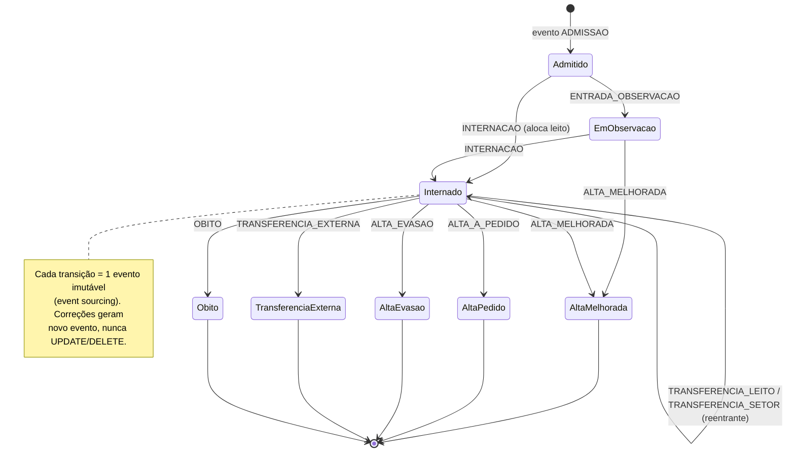
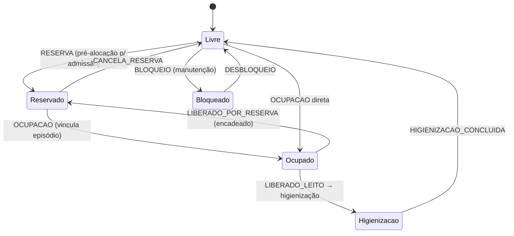

# Arquitetura ADT — Módulo de Internação (Redesenho)

> **Autor:** Arquiteto de Software Sênior (HIS/PEP) · **Data:** 2026-08-17
> **Escopo:** refatorar o módulo de internação para (A) juridicamente correto e (B) escalável.
> **Normas de referência:** SBIS/CFM (Manual de Certificação NGS1/NGS2), Res. CFM 1.821/2007,
> Res. CFM 1.638/2002, Res. CFM 2.299/2021, Lei 13.787/2018, Lei 14.063/2020, Lei 13.709/2018 (LGPD),
> RDC ANVISA 63/2011. Onde houver incerteza jurídica: **verificar com jurídico**.

---

## 0. Diagnóstico do baseline (o que existe hoje)

| Aspecto | Estado atual | Consequência |
|---|---|---|
| Episódio de internação | Inexistente — "internação" = `pacientes.setor_id` + `ativo` | Sem estado, sem histórico completo |
| Eventos de movimentação | Só `transferencias_paciente` (append-only, só transferência intra-unidade) | Admissão/alta/óbito/transferência externa sem trilha |
| Prescrição | `prescricao_itens` é **DELETE+INSERT** (substituição destrutiva) | Sem versionamento/retificação → viola NGS1 |
| Evolução/exames/AIH | **localStorage** (não persistem) | Sem valor probatório |
| Leito | `leitos.status` nunca sincroniza com paciente; alta não libera leito | Painel inconsistente |
| Censo | Views vivas (contagem ao vivo) | Sem histórico/indicadores |
| Auditoria | `log_auditoria` só para ações de gestão; **sem log de acesso a prontuário** | Não atende NGS1 |
| Escala | Duplicada: `escala_plantoes` (legada) × `escala_plantao` (dedicada) | Inconsistência na autorização |
| Admin | Cego para dados clínicos por design (bom) | Manter |
| Super admin | SELECT irrestrito em pacientes/prescricoes | **Requere log de acesso** |

---

## 1. MODELO DE DADOS ADT

### 1.1 Máquina de estados do episódio (mermaid)



### 1.2 Máquina de estados do leito (mermaid)



### 1.3 Tabelas centrais (SQL — Fase 1 na migration 0034)

```sql
-- EPISÓDIO DE INTERNAÇÃO (identidade + estado atual)
CREATE TABLE public.internacoes (
  id                 uuid PRIMARY KEY DEFAULT gen_random_uuid(),
  organizacao_id     uuid NOT NULL REFERENCES public.organizacoes(id),
  unidade_id         uuid NOT NULL REFERENCES public.unidades(id),
  paciente_id        uuid NOT NULL REFERENCES public.pacientes(id),
  tipo_internacao    text NOT NULL DEFAULT 'urgencia'
                     CHECK (tipo_internacao IN ('eletiva','urgencia','emergencia','observacao')),
  origem_admissao    text NOT NULL DEFAULT 'emergencia'
                     CHECK (origem_admissao IN ('emergencia','ambulatorio','outra_unidade','domicilio')),
  status             text NOT NULL DEFAULT 'admitido'
                     CHECK (status IN ('admitido','em_observacao','internado','alta_melhorada',
                                       'alta_pedido','alta_evasao','transferencia_externa','obito')),
  leito_atual_id     uuid REFERENCES public.leitos(id),
  setor_atual_id     uuid REFERENCES public.setores(id),
  data_admissao      timestamptz NOT NULL DEFAULT now(),
  data_entrada_setor timestamptz,
  data_alta          timestamptz,
  cid_principal      text,
  motivo_alta        text,
  created_at         timestamptz NOT NULL DEFAULT now(),
  updated_at         timestamptz NOT NULL DEFAULT now()
);
-- 1 episódio ATIVO por paciente por unidade (garantia de integridade)
CREATE UNIQUE INDEX IF NOT EXISTS uq_internacoes_paciente_ativo
  ON public.internacoes (paciente_id)
  WHERE status IN ('admitido','em_observacao','internado');

-- STREAM DE EVENTOS ADT (imutável; event sourcing com cadeia de hash)
CREATE TABLE public.eventos_adt (
  id                uuid PRIMARY KEY DEFAULT gen_random_uuid(),
  seq               integer NOT NULL,            -- ordem por episódio
  organizacao_id    uuid NOT NULL,
  unidade_id        uuid NOT NULL REFERENCES public.unidades(id),
  internacao_id     uuid NOT NULL REFERENCES public.internacoes(id),
  paciente_id       uuid NOT NULL,
  tipo_evento       text NOT NULL
                    CHECK (tipo_evento IN
                      ('admissao','entrada_observacao','internacao',
                       'transferencia_leito','transferencia_setor',
                       'solicitacao_alta','alta_melhorada','alta_pedido',
                       'alta_evasao','transferencia_externa','obito',
                       'cancelamento_alta','retificacao')),
  estado_antes      jsonb,
  estado_depois     jsonb,
  leito_origem_id   uuid, leito_destino_id uuid,
  setor_origem_id   uuid, setor_destino_id uuid,
  autor_id          uuid NOT NULL REFERENCES public.perfis(id),
  motivo            text,
  payload           jsonb,                       -- CID, motivo alta, etc.
  hash_previo       text,                        -- cadeia de integridade
  hash_conteudo     text NOT NULL,
  created_at        timestamptz NOT NULL DEFAULT now(),
  UNIQUE (internacao_id, seq)
);
CREATE INDEX IF NOT EXISTS idx_eventos_adt_internacao ON public.eventos_adt (internacao_id, seq);
CREATE INDEX IF NOT EXISTS idx_eventos_adt_unidade      ON public.eventos_adt (unidade_id, created_at);
CREATE INDEX IF NOT EXISTS idx_eventos_adt_paciente     ON public.eventos_adt (paciente_id, created_at);

-- EVENTOS DO LEITO (estado do recurso, desacoplado do paciente)
CREATE TABLE public.eventos_leito (
  id             uuid PRIMARY KEY DEFAULT gen_random_uuid(),
  leito_id       uuid NOT NULL REFERENCES public.leitos(id),
  unidade_id     uuid NOT NULL REFERENCES public.unidades(id),
  tipo_evento    text NOT NULL
                 CHECK (tipo_evento IN
                   ('reserva','cancelamento_reserva','ocupacao','liberacao',
                    'higienizacao','higienizacao_concluida','bloqueio','desbloqueio')),
  status_antes   public.status_leito,
  status_depois  public.status_leito,
  internacao_id  uuid REFERENCES public.internacoes(id),
  autor_id       uuid NOT NULL REFERENCES public.perfis(id),
  motivo         text,
  created_at     timestamptz NOT NULL DEFAULT now()
);
CREATE INDEX IF NOT EXISTS idx_eventos_leito_leito ON public.eventos_leito (leito_id, created_at);

-- DOCUMENTOS CLÍNICOS COM VERSIONAMENTO (retificação, nunca apagamento)
CREATE TABLE public.documentos_clinicos (
  id                  uuid PRIMARY KEY DEFAULT gen_random_uuid(),
  documento_raiz_id   uuid NOT NULL,             -- identidade lógica estável
  versao              integer NOT NULL DEFAULT 1,
  organizacao_id      uuid NOT NULL,
  unidade_id          uuid NOT NULL REFERENCES public.unidades(id),
  paciente_id         uuid NOT NULL REFERENCES public.pacientes(id),
  internacao_id       uuid REFERENCES public.internacoes(id),
  tipo_documento      text NOT NULL
                      CHECK (tipo_documento IN
                        ('admissao_anamnese','evolucao','prescricao','sumario_alta',
                         'sumario_obito','atestado','termo_consentimento',
                         'boletim_emergencia','partograma')),
  conteudo            text NOT NULL,
  conteudo_hash       text NOT NULL,             -- SHA-256 do conteúdo
  autor_id            uuid NOT NULL REFERENCES public.perfis(id),
  estado              text NOT NULL DEFAULT 'rascunho'
                      CHECK (estado IN ('rascunho','ativo','retificado','assinado','cancelado')),
  retificacao_de      uuid REFERENCES public.documentos_clinicos(id),
  motivo_retificacao  text,
  assinatura_id       uuid,                      -- ICP-Brasil (fase 2)
  assinado_em         timestamptz,
  carimbo_tempo       timestamptz,
  created_at          timestamptz NOT NULL DEFAULT now(),
  updated_at          timestamptz NOT NULL DEFAULT now(),
  UNIQUE (documento_raiz_id, versao)
);
CREATE INDEX IF NOT EXISTS idx_doc_paciente ON public.documentos_clinicos (paciente_id, documento_raiz_id, versao);

-- LOG DE ACESSO A PRONTUÁRIO (NGS1: quem viu, quando, de onde)
CREATE TABLE public.log_acesso_prontuario (
  id              uuid PRIMARY KEY DEFAULT gen_random_uuid(),
  organizacao_id  uuid NOT NULL,
  unidade_id      uuid NOT NULL REFERENCES public.unidades(id),
  paciente_id     uuid NOT NULL REFERENCES public.pacientes(id),
  internacao_id   uuid REFERENCES public.internacoes(id),
  acessado_por    uuid NOT NULL REFERENCES public.perfis(id),
  papel           text,
  tipo_acesso     text NOT NULL DEFAULT 'leitura_prontuario'
                  CHECK (tipo_acesso IN ('leitura_prontuario','leitura_documento','impressao','exportacao')),
  documento_id    uuid,
  ip              inet,
  user_agent      text,
  created_at      timestamptz NOT NULL DEFAULT now()
);
CREATE INDEX IF NOT EXISTS idx_log_acesso_pac ON public.log_acesso_prontuario (paciente_id, created_at DESC);
CREATE INDEX IF NOT EXISTS idx_log_acesso_ator ON public.log_acesso_prontuario (acessado_por, created_at DESC);

-- CENSO MATERIALIZADO (projeção alimentada pelos eventos ADT)
CREATE TABLE public.censo_ocupacao (
  organizacao_id       uuid NOT NULL,
  unidade_id           uuid NOT NULL REFERENCES public.unidades(id),
  setor_id             uuid NOT NULL REFERENCES public.setores(id),
  data                 date NOT NULL,
  turno                text NOT NULL DEFAULT 'diario',
  internados           integer NOT NULL DEFAULT 0,
  leitos_total         integer NOT NULL DEFAULT 0,
  leitos_ocupados      integer NOT NULL DEFAULT 0,
  leitos_livres        integer NOT NULL DEFAULT 0,
  leitos_higienizacao  integer NOT NULL DEFAULT 0,
  leitos_bloqueados    integer NOT NULL DEFAULT 0,
  taxa_ocupacao        numeric,
  permanencia_media_h  numeric,
  giro_leito           numeric,
  snapshot             jsonb,
  criado_em            timestamptz NOT NULL DEFAULT now(),
  PRIMARY KEY (unidade_id, setor_id, data, turno)
);
CREATE INDEX IF NOT EXISTS idx_censo_unidade ON public.censo_ocupacao (unidade_id, data DESC);

-- SUGESTÃO DE PRESCRIÇÃO (gestor SUGERE; só médico altera)
CREATE TABLE public.sugestoes_prescricao (
  id              uuid PRIMARY KEY DEFAULT gen_random_uuid(),
  organizacao_id  uuid NOT NULL,
  unidade_id      uuid NOT NULL REFERENCES public.unidades(id),
  paciente_id     uuid NOT NULL REFERENCES public.pacientes(id),
  internacao_id   uuid REFERENCES public.internacoes(id),
  gestor_id       uuid NOT NULL REFERENCES public.perfis(id),
  descricao       text NOT NULL,
  status          text NOT NULL DEFAULT 'pendente'
                  CHECK (status IN ('pendente','aceita','recusada','retirada')),
  decidido_por    uuid REFERENCES public.perfis(id),
  decidido_em     timestamptz,
  created_at      timestamptz NOT NULL DEFAULT now(),
  updated_at      timestamptz NOT NULL DEFAULT now()
);
```

**Decisões → norma:**
- Episódio + eventos imutáveis → **NGS1** (integridade/autenticidade); **CFM 1.821/2007 §I.2** (conteúdo mínimo do prontuário); **Lei 13.787/2018** (guarda digital com preservação).
- Retificação por nova versão → **NGS1** (não repúdio) e boa prática de prontuário eletrônico.
- 1 episódio ativo por paciente → integridade referencial da internação.
- Leito como recurso com eventos → desacopla recurso de paciente; correção do censo.

---

## 2. CONFORMIDADE JURÍDICA

### 2.1 Checklist NGS1 — implementar já

| Requisito NGS1 | Implementação | Estado |
|---|---|---|
| Autenticação forte | Já existe via Supabase Auth (email+senha); evoluir p/ MFA (TOTP) | Falta MFA |
| Controle de sessão | Sessão Supabase; definir timeout + revogação | Falta política de expiração |
| RBAC granular | `vinculos.papel` por unidade + gate de escala (`na_escala_agora`) | ✅ existe |
| Trilha de auditoria completa | `log_acesso_prontuario` (novo) + `eventos_adt` + `log_auditoria` | **Criar + alimentar** |
| Controle de versão de documentos | `documentos_clinicos` (versão + retificação) | **Criar** |
| Disponibilidade/backup | Supabase (backup automático + PITR) | ✅ provider |
| Isolamento multi-tenant | RLS por unidade + `organizacao_id` denormalizado | Reforçar |

### 2.2 Caminho para NGS2 (assinatura ICP-Brasil)

- **Onde assinar (qualificada — NGS2/ICP-Brasil):** evolução, prescrição, sumário de alta/óbito, atestado, termo de consentimento.
- **Onde assinatura avançada é aceitável (Lei 14.063/2020):** fluxos internos de gestão (ex.: validação de checklist, autorização de transferência) — **não** em documento clínico assistencial.
- **Ponto de hash + carimbo do tempo:** em `documentos_clinicos` — `conteudo_hash` (SHA-256 do conteúdo) + `carimbo_tempo` no momento da assinatura; gravar `assinatura_id` retornado pelo provedor (ex.: VIDaaS/ICP-Brasil). A cadeia de hash também existe em `eventos_adt.hash_previo`.

### 2.3 Fluxo híbrido (até NGS2)

1. Documento eletrônico é a **cópia de trabalho** (rascunho/ativo).
2. Ao finalizar, gera PDF com `conteudo_hash` + data/hora + nome/autor.
3. **Impressão + assinatura física** do responsável → o físico é o original (validade jurídica plena), o eletrônico é cópia digital.
4. Escanear e anexar ao episódio (bucket privado) como documento — preserva valor probatório sem falsa impressão de "assinatura eletrônica válida".

### 2.4 LGPD

| Pilar | Implementação |
|---|---|
| Minimização por papel | **Backend/RLS**: admin nunca lê dado identificado (políticas já o excluem — manter e testar). Reforço: `organizacao_id` denormalizado + RLS |
| Log de acesso a prontuário | `log_acesso_prontuario` (novo) — gravar a cada abertura de prontuário/documento (RPC `registrar_acesso_prontuario`) |
| Base legal | Tutela da saúde (LGPD art. 11, II, "a") — dispensa consentimento para ato assistencial; **registrar** o tratamento e dar transparência ao titular |
| Retenção | Política de 20 anos (prontuário) — implementar TTL/arquivamento por `data_alta` |
| Pseudonimização | Dashboards agregados usam **supressão 1–4** (já existe) + nunca exibir identificadores |
| DPA (isolamento) | RLS: todas as queries filtra por unidade/organização via policies (ver §3) |

### 2.5 Sugestão de prescrição do gestor

- Entidade `sugestoes_prescricao` (gestor **sugere**).
- Transições `pendente → aceita/recusada/retirada` com `decidido_por` (plantonista/médico) e `decidido_em`.
- Nenhuma sugestão altera diretamente `prescricoes` — só o médico (plantonista assistente) cria/edita a prescrição (CFM 1.821/2007 — prescrição é ato médico).

---

## 3. ESCALABILIDADE MULTI-TENANT

### 3.1 Estratégia de isolamento: **shared-schema + RLS** (recomendado para o estágio)

| Critério | Schema-per-tenant | Shared-schema + RLS (escolhido) |
|---|---|---|
| Custo operacional | Migrações ×N, conexões/bancos | Uma instância, migrações únicas |
| Isolamento físico | Forte | Lógico (forte com RLS bem escrita) |
| Escala (10–50 unidades) | Desnecessário agora | Adequado |
| Complexidade | Alta | Média |
| Norma/segurança | — | RLS + policies testadas atendem NGS1 |

**Reforço:** adicionar `organizacao_id` denormalizado nas novas tabelas clínicas e incluir na policy; manter a regra "admin não vê clínico" (não usar `unidades_do_usuario` — que inclui admin — nas tabelas clínicas; usar `unidades_gestor_plantonista`/`papel_na_unidade`).

### 3.2 Índices e particionamento

- `eventos_adt`: **particionar por mês** (`PARTITION BY RANGE (created_at)`) quando > ~10M linhas; índices em `(internacao_id, seq)`.
- `documentos_clinicos`: índice `(paciente_id, documento_raiz_id, versao)`; considerar particionamento por ano quando crescer.
- `log_acesso_prontuario`: particionar por mês (append-only, alto volume).
- `censo_ocupacao`: PK composta já otimiza leitura por unidade/data.

### 3.3 Painel de leitos em tempo real

| Padrão | Prós | Contras | Recomendação |
|---|---|---|---|
| Polling (10s) | Simples, compatível | Latência, carga | **Usar agora** (10–50 unidades é leve) |
| SSE | Push 1 direção, HTTP, retry nativo | Estado de conexão no edge | Próximo passo (quando >50 unidades ou necessidade de sub-segundo) |
| WebSocket | Bidirecional | Mais complexo, proxy/estado | Diferencial futuro (chat já usa) |

**Decisão:** **polling 10–15s** para o painel (já existe o padrão no `usePlantao` 60s), evoluir para **SSE** via Supabase Realtime quando o volume justificar.

---

## 4. DOCUMENTOS DA INTERNAÇÃO (mínimo legal)

Base: **CFM 1.821/2007** (§I.2 — conteúdo do prontuário), **RDC 63/2011** (documentação mínima).

| Documento | Obrigatoriedade | Fase de implementação | Template de dados |
|---|---|---|---|
| Admissão / anamnese | Obrigatório | 1 | identificação, queixa, HDA, antecedentes, exame físico, hipóteses, plano |
| Evoluções diárias | Obrigatório (1/dia mínimo) | 1 | data/hora, status, exame físico, conduta, evolução SOAP |
| Prescrição diária | Obrigatório | 1 (migrar de `prescricao_itens`) | itens, dose, via, posologia, validade, autor |
| Termo de consentimento | Quando houver procedimento | 2 | procedimento, riscos, benefícios, autorizações |
| Sumário de alta / óbito | Obrigatório na alta | 2 | diagnósticos, CID, evolução final, orientações, óbito: causa |
| CIHA (SUS) | Quando SUS (internação) | 3 | **verificar com jurídico** os campos exigidos pela legislação vigente |
| Partograma / boletim | Quando aplicável (obstetrícia/emergência) | 3 | avaliações seriadas por tempo |

**Implementação de persistência:** todos viram `documentos_clinicos` (conteúdo estruturado/JSON + hash), com o rascunho em memória (useRascunho) migrando para persistência automática.

---

## 5. PLANO DE MIGRAÇÃO INCREMENTAL

### Fase 1 — Eventos ADT + auditoria (esta entrega)

- [x] Migration 0034: `internacoes`, `eventos_adt`, `eventos_leito`, `documentos_clinicos`, `log_acesso_prontuario`, `censo_ocupacao`, `sugestoes_prescricao` + RLS.
- [ ] RPC `abrir_internacao` (admissão → cria episódio + evento `admissao` + opcionalmente aloca leito).
- [ ] RPC `registrar_evento_adt` (transições com cadeia de hash; SECURITY DEFINER).
- [ ] RPC `registrar_acesso_prontuario` (log de quem viu).
- [ ] Reescrita de `transferir_paciente` → emite `eventos_adt` (transição de estado) em vez de só `UPDATE pacientes.setor_id`.
- [ ] Alta via RPC → emite evento `alta_*` + libera leito (evento `liberacao`).

### Fase 2 — Assinatura e documentos

- [ ] Persistir `documentos_clinicos` (evolução, admissão, exames, AIH) — substituir localStorage.
- [ ] Integração ICP-Brasil (VIDaaS ou equivalente) no ponto `assinatura_id`/`carimbo_tempo`.
- [ ] Fluxo híbrido: gerar PDF + orientar assinatura física (até NGS2).

### Fase 3 — Censo/indicadores

- [ ] RPC `gerar_censo_diario` (alimenta `censo_ocupacao` a partir dos eventos ADT).
- [ ] Endpoint/rotina agendada (Supabase scheduled functions) + dashboard de indicadores.

---

## 6. RISCOS E DECISÕES ABERTAS

| Item | Decisão / risco |
|---|---|
| Escala duplicada (`escala_plantoes` × `escala_plantao`) | **Unificar** em `escala_plantao` (a dedicada) — migrar `transferir_paciente` e remover legada |
| Super admin com acesso irrestrito | Manter (necessário p/ suporte), **obrigar log de acesso** |
| Evolução dos campos da CIHA | **verificar com jurídico** |
| Assinatura avançada (14.063) em documento clínico | **não usar** — reservar para fluxos administrativos; verificar com jurídico |
